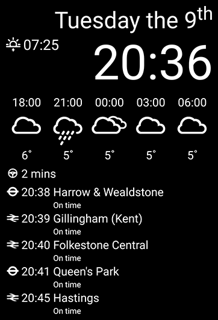

# MirrorHub
Copyright (C) 2016 Christian Pötzsch

## Content

MirrorHub is another software implementation for a smart mirror on top of Android. Although there already several projects out there doing the same, this one fulfills my specific needs: 
 1. Works on Android
 2. Works on Android API level 10 onwards
 3. Has all the modules important to me here in the UK

Currently the following modules are implemented:
 1. Time/Date
 2. Sunrise/Sunset
 3. Weather information from the UK MetOffice
 4. Travel time to work by car
 5. Next tube trains from a specific station
 6. Next national rail trains from a specific station
 7. Upcoming calendar events for the next few days (API level >= 23)

Some of those modules can be seen here in action: 



## Configuration

Everything is build time configured through the gradle.properties file. See [gradle.properties.example](gradle.properties.example) for the available options. You will need to sign up for the various web services used by the project and put the corresponding API keys in there.
The rest of the file configures the various modules and gradle.properties.example shows in which formats this needs to be.

## Building

MirrorHub uses gradle and therefore building should be as simple as:

```
cd /path/to/MirrorHub
./gradlew build
```

## License
The MIT License (MIT)
